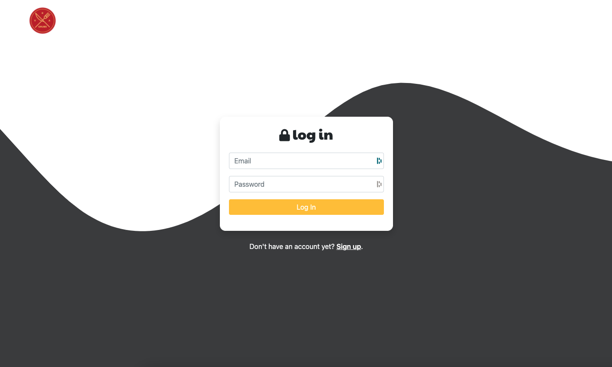

# RVA GRUBS | Foodie Hub Built With React

---

## **Table of Contents**

1. [Status](#Status)
2. [Description](#Description)
3. [Tech Stack](#Tech-Stack)
4. [Screenshots](#Screenshots)
5. [Installation](#Installation)
6. [License](#License)
7. [Contributions](#Contributions)
8. [Authors](#Authors)

---

## Status

Project is **IN DEVELOPMENT**, and has **NOT** been deployed yet. To see up-to-date progress, clone the repository to your local machine and run `npm run dev` in the root folder. Then navigate to http://localhost:3000.

---

## **Description**

Receive member-only discounts to Richmond's favorite restaurants. Create an account today!

---

## **Tech Stack**

- React
- Firebase
- Node
- Express
- Redux
- getwaves.io

---

## **Screenshots**

---

## **Installation**

1. Clone the repo: `git clone https://github.com/jallan07/react-rvagrubs.git`
2. Install server-side NPM packages: `npm i`
3. Install client-side NPM packages: `cd client && npm i`

---

## **License**

Distributed under the MIT License.

---

## **Contributions**

**Current Contributors:**

_Josh Allan, Mark Cross_

Contributions are what make the open source community such an amazing place to be learn, inspire, and create. Any contributions you make are greatly appreciated.

1. Fork the Project
2. Create your Feature Branch (git checkout -b feature/AmazingFeature)
3. Commit your Changes (git commit -m 'Add some AmazingFeature')
4. Push to the Branch (git push origin feature/AmazingFeature)
5. Open a Pull Request

---

## **Authors**

Below is contact information for the authors of this application. Please feel free to reach out directly if additional questions exist.

| Name       | Email                  | Portfolio                                     | Github                                      |
| ---------- | ---------------------- | --------------------------------------------- | ------------------------------------------- |
| Josh Allan | allan.josh07@gmail.com | [joshallan.dev](https://www.joshallan.dev/)   | [jallan07](https://github.com/jallan07)     |
| Mark Cross | markdcross@gmail.com   | [markdcross.dev](https://www.markdcross.dev/) | [markdcross](https://github.com/markdcross) |

---

### Thank you for using RVA GRUBS!
